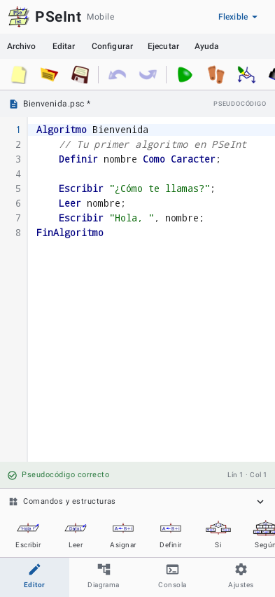
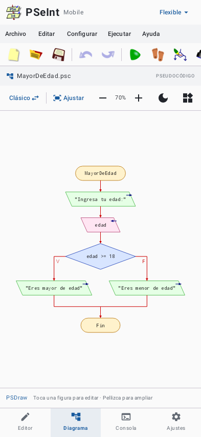
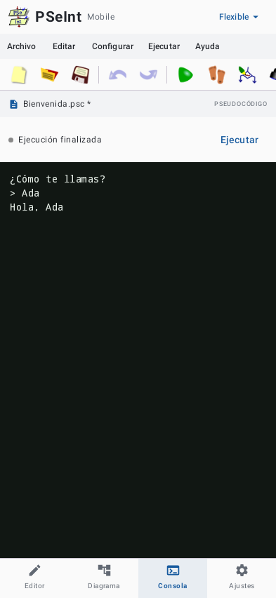

# PSeInt Mobile 📱

> **La experiencia completa de PSeInt en tu dispositivo Android.**  
> Editor de pseudocódigo, diagramas de flujo interactivos y ejecución nativa offline con el motor C++ original de Pablo Novara.

[](http://pseint-mobile.unaux.com)
[](website/licenses/pseint-gpl-v2.txt)
[](https://pseint.sourceforge.net/)
[-green.svg)](https://developer.android.com)
[](https://developer.android.com/jetpack/compose)

---

## 🌟 Descripción

**PSeInt Mobile** es una adaptación independiente, libre y de código abierto para Android diseñada para estudiantes, docentes y entusiastas de la lógica de programación. 

🌐 **Sitio web oficial y descargas:** [http://pseint-mobile.unaux.com](http://pseint-mobile.unaux.com)

A diferencia de otras soluciones que aproximan o interpretan el lenguaje de manera incompleta, PSeInt Mobile **integra y compila el motor C++ nativo original de PSeInt** de Pablo Novara mediante la interfaz NDK/JNI de Android. Esto asegura una compatibilidad absoluta de sintaxis, reglas, ejecución y perfiles institucionales.

---

## 🚀 Características Principales

### ✏️ Editor de Código Avanzado
- **Sintaxis auténtica:** Resaltado léxico fiel a PSeInt de escritorio, diferenciando comandos, operadores, tipos, comentarios y cadenas.
- **Asistencia inteligente:** Autocompletado contextual de instrucciones, funciones predefinidas, fecha/hora y variables locales. Ayudas de argumentos emergentes.
- **Herramientas de edición:** Números de línea sincronizados, desplazamiento horizontal, sangría automática, deshacer/rehacer ilimitado y búsqueda con reemplazo.
- **Soporte de archivos `.psc`:** Abre y guarda algoritmos con extensión `.psc` pura, con detección automática de codificación (UTF-8, UTF-16 y Windows-1252).
- **Recuperación de borradores:** Guarda automáticamente el estado del editor para reanudar el trabajo al volver a abrir la aplicación.

### ⚙️ Motor Nativo C++ y Consola
- **Motor original integrado (versión 20250225):** Ejecución directa en C++ en el procesador del móvil (arm64-v8a, armeabi-v7a, x86_64).
- **100% Offline:** Sin necesidad de internet, servidores remotos ni cuentas de usuario.
- **Consola interactiva:** Soporte para `Sin Saltar`, `Borrar Pantalla`, entradas interactivas por teclado y opción de cancelación inmediata.
- **Depuración visual:** Modo de ejecución paso a paso con seguimiento de la línea activa y tabla de inspección de variables en tiempo real.

### 📊 Diagramas de Flujo (PSDraw)
- **Diagramas Clásicos:** Representación visual completa de inicio, decisiones, ramas y ciclos.
- **Diagramas Nassi–Shneiderman:** Representación estructurada en bloques.
- **Interactividad total:** Zoom, desplazamiento táctil, ajuste automático a pantalla y edición bidireccional tocando figuras.
- **Exportación:** Exporta diagramas en alta calidad a formato de imagen PNG mediante el selector del sistema.

### 🎛️ Perfiles Institucionales y Personalización
- **24 opciones de lenguaje:** Control riguroso o flexible sobre definición obligatoria de variables, punto y coma, sintaxis de asignación, dimensiones y más.
- **Perfiles preconfigurados:** Incluye el catálogo oficial de perfiles universitarios e institucionales de PSeInt escritorio.
- **Importación/Exportación:** Compatibilidad con archivos `.prf` de escritorio.
- **Personalización visual:** Interfaz clásica clara por defecto, tema oscuro completo y temas visuales alternativos.

---

## 🖼️ Capturas de Pantalla

| Editor Clásico | Diagramas de Flujo | Consola de Resultados |
| :---: | :---: | :---: |
|  |  |  |

---

## 🛠️ Requisitos y Compilación

### Requisitos Previos
* **Android Studio:** Ladybug (2024.2) o superior.
* **JDK:** Java 17 o superior.
* **Android SDK:** API 36 (Android 15+ compatible desde API 24).
* **Android NDK:** 28.2.13676358.
* **CMake:** 3.22.1.

### Compilar desde la Terminal

Configura la ruta de tu JDK y compila el APK de desarrollo:

```powershell
# En Windows PowerShell
$env:JAVA_HOME = "C:/Program Files/Android/Android Studio/jbr"
./gradlew.bat :app:assembleDebug
```

```bash
# En Linux / macOS
export JAVA_HOME="/path/to/jdk-17"
./gradlew :app:assembleDebug
```

El instalador compilado se generará en:
`app/build/outputs/apk/debug/app-debug.apk`

---

## 🧪 Pruebas y Verificación

El proyecto cuenta con una amplia suite de pruebas automatizadas que validan tanto el código Kotlin como la integridad del motor nativo C++:

```powershell
# Compilar pruebas nativas para la JVM de pruebas
./tools/build-native-tests.ps1 -Compiler "C:/ruta/llvm-mingw/bin/clang++.exe"

# Ejecutar pruebas unitarias, lint y verificación visual
./gradlew.bat :app:testDebugUnitTest :app:lintDebug "-Proborazzi.test.record=true"
```

- **Compatibilidad del motor:** Se evalúan los 195 casos de prueba de `pseint/test/interp` y se validan las 24 opciones contra 466 perfiles.
- **Verificación UI:** Pruebas unitarias de Robolectric y capturas de pantalla de Roborazzi en `app/build/outputs/screenshots/`.
- Más información en [`docs/motor-nativo.md`](docs/motor-nativo.md) y [`docs/archivos-y-autocompletado.md`](docs/archivos-y-autocompletado.md).

---

## 📁 Estructura del Proyecto

```text
pseint-mobile/
├── app/                      # Módulo principal Android (Kotlin + Jetpack Compose)
│   ├── src/main/cpp/         # JNI bridge y adaptadores para el motor C++
│   ├── src/main/java/        # Código fuente de la aplicación
│   ├── src/main/res/         # Recursos (layouts, drawables, iconos, temas)
│   └── src/test/             # Pruebas unitarias y suites de compatibilidad
├── docs/                     # Documentación técnica de arquitectura y pruebas
├── gradle/                   # Gradle Wrapper oficial
├── pseint/                   # Código fuente original de PSeInt de Pablo Novara
├── ScreenShots/              # Capturas de referencia de la aplicación
├── tools/                    # Scripts de utilidad para compilación y verificación
├── website/                  # Sitio web estático de presentación, descarga y licencia
├── THIRD_PARTY_NOTICES.md    # Avisos de recursos y componentes de terceros
└── README.md                 # Este archivo
```

---

## 🌐 Sitio Web Oficial

El sitio oficial del proyecto se encuentra disponible en:  
👉 **[http://pseint-mobile.unaux.com](http://pseint-mobile.unaux.com)**

El código fuente completo de la web se encuentra en la carpeta [`website/`](website/), preparado para desplegarse en cualquier hosting estático o servidor. Incluye:
- Presentación de funciones, diseño adaptable a móviles y galería interactiva con lightbox.
- Descarga directa del instalador APK conectado a los lanzamientos oficiales de GitHub Releases.
- Enlace directo al repositorio del proyecto en GitHub: [`https://github.com/tocx280mn/PSeInt-Mobile`](https://github.com/tocx280mn/PSeInt-Mobile).
- Sección completa de créditos, Copyleft y visor integrado de la licencia GNU GPL v2 en [`credits.html`](website/credits.html).

---

## 📜 Licencia y Copyleft

**PSeInt de escritorio es obra original de Pablo Novara (zaskar_84@yahoo.com.ar), desarrollada y distribuida bajo Copyleft y la GNU General Public License versión 2.**

PSeInt Mobile mantiene fielmente esta filosofía:
- Todo el código derivado y las adaptaciones se distribuyen bajo la **GNU General Public License versión 2 (GPLv2)**.
- **Sin Copyright privativo:** PSeInt Mobile pertenece a la comunidad y a la tradición del software libre educativo.
- Para conocer el proyecto original de escritorio, visita el sitio oficial: [https://pseint.sourceforge.net/](https://pseint.sourceforge.net/).
- Consulta el texto completo de la licencia en [`website/licenses/pseint-gpl-v2.txt`](website/licenses/pseint-gpl-v2.txt) y los avisos de atribución en [`THIRD_PARTY_NOTICES.md`](THIRD_PARTY_NOTICES.md).

